# NetworkOS Business Architecture

## 1. Primary Operating Model
NetworkOS is a Founder Relationship Intelligence System designed to transition relationships and intelligence into actionable network opportunities under strict founder control.

The system's core operating principle is:
`INTELLIGENCE → CONTEXT → TRUST → DECISION → ACTION → OUTCOME → LEARNING`

## 2. Core Business Workflow
The entire architecture must structurally reflect this flow:

```mermaid
graph TD
    LinkedIn[LINKEDIN PROFILE URL] --> Enrich[RESEARCH & ENRICH ENGINE]
    Enrich --> Intel[PERSON + COMPANY INTELLIGENCE]
    Intel --> Signal[SIGNAL ENGINE]
    Signal --> Evidence[EVIDENCE ENGINE]
    Evidence --> Contact360[CONTACT 360° INTELLIGENCE]
    Contact360 --> BiDirectional[HOW CAN THEY HELP US? + HOW CAN WE HELP THEM?]
    BiDirectional --> RelEngine[RELATIONSHIP ENGINE]
    RelEngine --> Context[CURRENT CONTEXT]
    Context --> Meeting[FOUNDER MEETING]
    Meeting --> MeetingIntel[MEETING INTELLIGENCE]
    MeetingIntel --> Extracted[PROBLEMS / REQUIREMENTS / PEOPLE]
    Extracted --> Validation[FOUNDER VALIDATION]
    Validation --> TrustedStore[TRUSTED CONTEXT STORE]
    TrustedStore --> OppEngine[OPPORTUNITY ENGINE]
    OppEngine --> MatchEngine[NETWORK MATCH]
    MatchEngine --> MatchPaths[INTERNAL / NETWORK / HYBRID MATCH]
    MatchPaths --> Ranking[MATCH RANKING ENGINE]
    Ranking --> Why[WHY THIS MATCH?]
    Why --> Approval[FOUNDER APPROVAL]
    Approval --> Draft[INTRODUCTION MESSAGE]
    Draft --> Intro[INTRODUCTION]
    Intro --> Deal[CONVERSATION / DEAL]
    Deal --> CRM[CRM / OPPORTUNITY PIPELINE]
    CRM --> Feedback[FEEDBACK LOOP]
    Feedback --> AI[AI LEARNING]
```

## 3. CRM Position
NetworkOS acts as the intelligence pre-processor to the CRM. The CRM (Opportunity Pipeline) is the **downstream operational destination**. The frontend architecture must prevent NetworkOS from looking like or behaving like a traditional Kanban or Task board until the opportunity explicitly reaches the operational execution phase.

## 4. Trust and Control Boundary
NetworkOS explicitly separates AI interpretation from Founder Intent. The system may process, enrich, hypothesize, and recommend, but it must never:
- Fabricate evidence
- Autonomously send an introduction
- Automatically confirm a hypothesis
- Turn a recommendation into an executed action without founder approval
