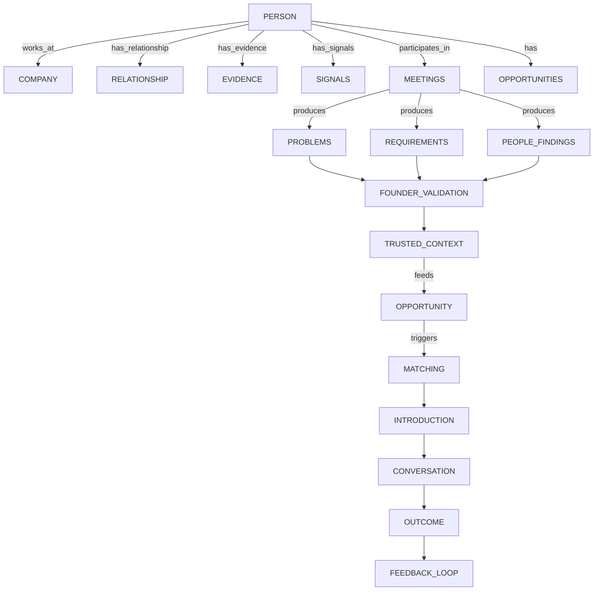

# NetworkOS Domain Model

## 1. Canonical Domain Entities

### Person
- **Purpose:** Represents an individual in the founder's network.
- **Relationships:** `works_at` Company, `has_relationship` Founder, `has_evidence` Evidence, `participates_in` Meeting.

### Company
- **Purpose:** Represents an organization.
- **Relationships:** `employs` Person, `has_opportunities` Opportunity.

### Relationship
- **Purpose:** Represents the connection strength and interaction history.
- **Relationships:** Links Person ↔ Founder, Person ↔ Company, Person ↔ Person.

### Evidence
- **Purpose:** The source of truth for an inference.
- **Trust State:** ALWAYS `FACT`.

### Signal
- **Purpose:** An observed external trigger.
- **Trust State:** `SIGNAL`.

### Intelligence (Inference / Hypothesis)
- **Purpose:** AI-derived understanding of a Person or Company.
- **Trust State:** `INFERENCE` or `HYPOTHESIS`. Needs `FOUNDER CONFIRMED`.

### Meeting
- **Purpose:** A temporal event where relationship context transitions to extracted needs.
- **Relationships:** `produces` Problem/Requirement/People Findings.

### Problem / Requirement / People Finding
- **Purpose:** Discrete needs extracted from a meeting.
- **Trust State:** `INFERENCE` until `CONFIRMED`.

### Trusted Context
- **Purpose:** The versioned, auditable, evidence-backed vault of founder-approved intelligence.
- **Lifecycle:** It is NOT strictly immutable. A founder may correct previously confirmed information.
  - `Trusted Context v1 -> Founder correction -> Trusted Context v2`
  - Previous versions remain auditable. Opportunity Engine always consumes the current valid version.
- **Relationships:** Downstream-consumable source for the Opportunity Engine.

### Opportunity
- **Purpose:** A structured representation of a validated need. Independent domain entity.
- **Relationships:** Preserves references to Person, Company, Relationship, Source Meeting, Trusted Context, Problem, Requirement, and Evidence.
- **Lifecycle:** An Opportunity may later have multiple meetings, matches, introductions, conversations, and outcomes.

### Capability / Product / Service
- **Purpose:** Internal knowledge base of what "we" offer.

### Network Match
- **Purpose:** Proposed connection between a Need and a Solution.

### Match Ranking
- **Purpose:** AI evaluation of Match dimensions.

### Introduction
- **Purpose:** Drafted message to execute the match.

### Outcome / Feedback
- **Purpose:** Empirical result of an Introduction.

## 2. Entity Relationship Diagram

