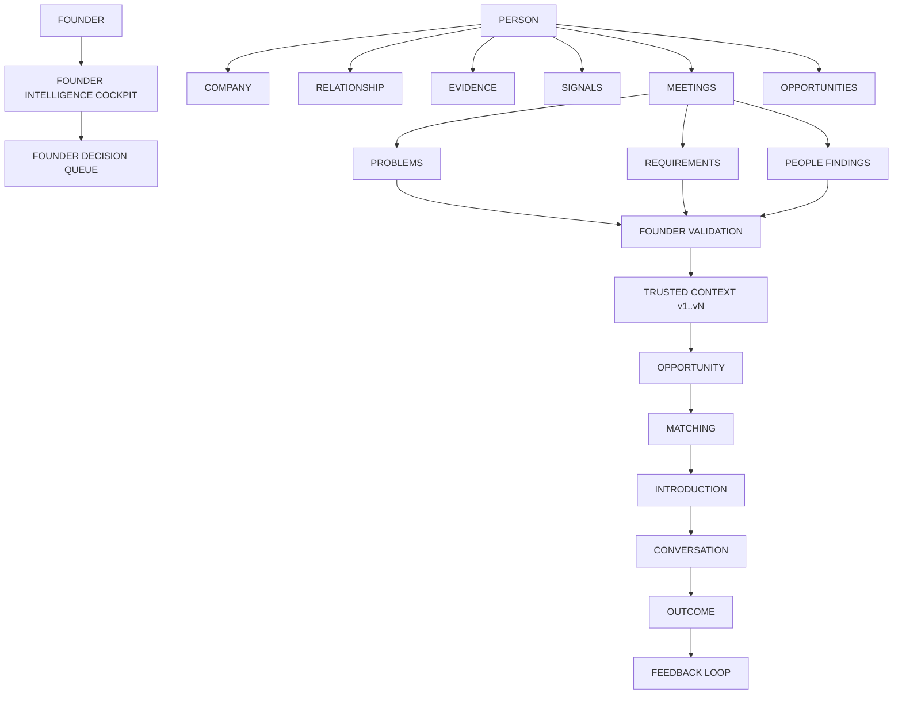

# NetworkOS Target Architecture Master Diagram

The target architecture enforces the principle:
`INTELLIGENCE → CONTEXT → TRUST → DECISION → ACTION → OUTCOME → LEARNING`

## 1. Master Domain Flow

## 2. Cockpit Information Architecture
`FOUNDER ATTENTION` → `WHY IT MATTERS` → `EVIDENCE / CONTEXT` → `FOUNDER ACTION` → `NEXT STEP`
